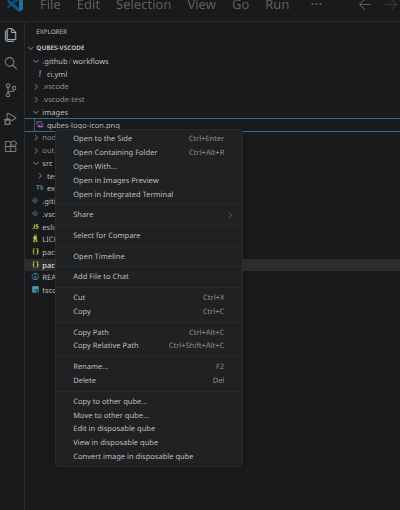

# QubesOS VSCode extension (unofficial)

This extension adds relevant Qubes OS related context menu items to VSCode: copy to other qube, move to other qubes, view in disposable...

[](https://github.com/thom-gdpt/qubes-vscode/actions/workflows/ci.yml)
[](LICENSE)

## Features

This extension adds the following context menu items when right-clicking files or folders in the VSCode Explorer:

- **Copy to other qube...** - Copy selected files/folders to another qube
- **Move to other qube...** - Move selected files/folders to another qube (with confirmation)
- **Edit in disposable qube** - Open a file in a disposable VM for editing
- **View in disposable qube** - Open a file in a disposable VM in read-only mode
- **Convert to trusted image** - Only available for image file types
- **Convert to trusted PDF** - Only available for PDF files



Based on [QubesOS core agent](https://github.com/QubesOS/qubes-core-agent-linux)

## Installation

### Marketplace

Available on Visual Studio Marketplace and Open VSX Registry

### From source

```bash
npm install
npm run package
code --install-extension ./qubes-vscode-1.0.0.vsix
```

## License

MIT